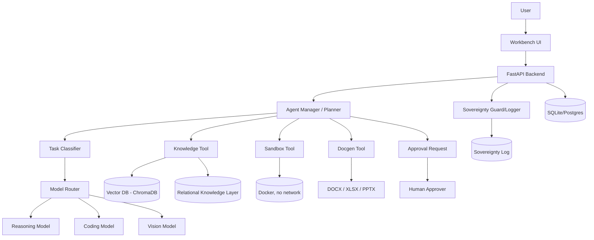
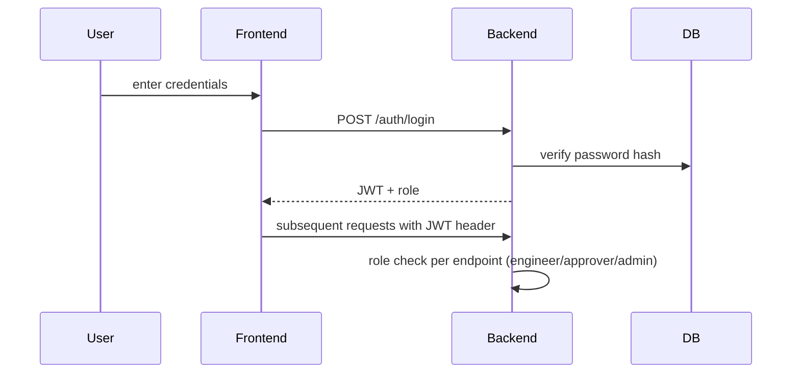
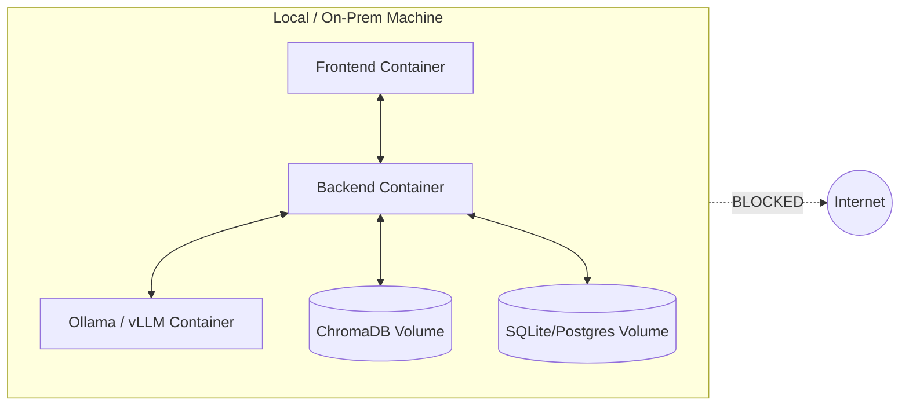

# Architecture.md — Sovereign Agentic AI Workbench

---

## 1. Architecture Selection Brainstorm

**What the PS really asks for:** a trustworthy, model-agnostic, multimodal, agentic execution environment for confidential industrial work — not a chatbot, not a trained model.

**What users need:** upload messy real-world documents → get a real, verifiable deliverable → without confidential data leaving the building.

**What Architecture 1 (Sovereign Agent Workbench) provides:** the complete generic loop — model routing, RAG, tools, sandboxing, network isolation. Feasible in a hackathon, covers every mandatory PS requirement.

**What Architecture 2 (Industrial Copilot + Knowledge Graph) provides:** industrial differentiation — equipment/SOP/report relationships modeled explicitly, stronger "why is this industrial-specific" answer, roadmap toward P&ID understanding.

**What can be combined:** Use Architecture 1 as the full backbone (agent manager, model router, tools, sandbox, network guard). Add a **lightweight relational knowledge layer** on top of RAG — not a full graph database, just structured metadata linking (equipment ↔ SOP ↔ report) stored in normal relational tables with a graph-like query pattern. This gives Architecture 2's story without Architecture 2's implementation cost.

**Would a simpler custom architecture be better?** No — the hybrid above is already close to minimal; further simplification would drop mandatory PS requirements (multi-model routing or agentic tool use).

**Final decision:** Hybrid — "Sovereign Agent Workbench with a Lightweight Industrial Knowledge Layer."

---

## 2. Why This Architecture Was Selected

| Requirement | Covered by |
|---|---|
| On-premise / air-gapped | Network guard + local model serving |
| Multiple models, auto-selected | Model Router + Task Classifier |
| Agentic behavior | Agent Manager / Planner |
| Tool use | Tool Layer (sandbox, file, docgen, knowledge) |
| Multimodal | OCR + Vision model in ingestion pipeline |
| Local knowledge | RAG (vector) + lightweight relational knowledge layer |
| Real deliverables | docgen_tool (docx/xlsx/pptx) |
| Evidence-grounded output | Citation metadata carried through retrieval → response |
| Human governance | Approval Request workflow |
| Industrial differentiation | Equipment↔SOP↔Report relational linking |

This gives full PS coverage at hackathon-feasible complexity, with a believable upgrade path.

---

## 3. System Design Overview (Mermaid)



---

## 4. Module-Wise Breakdown

### 4.1 Frontend Architecture
- React + Vite SPA
- Pages: Login, Workbench (chat + upload), Evidence Panel, Approval Modal, Sovereignty Dashboard, Admin (national round+)
- State: React Context or lightweight store (Zustand) for agent-run status polling
- Communicates only with local backend (`http://localhost:8000`), never external hosts

### 4.2 Backend Architecture
- FastAPI, layered: `api/` (routes) → `agent/` (orchestration) → `rag/` + `tools/` (capabilities) → `db/`
- Async endpoints for long-running agent tasks; poll-based status (`/agent/run/{id}/status`) to keep MVP simple (no websockets required)

### 4.3 Database Architecture
**MVP: SQLite. National round: PostgreSQL.**

Tables:
- `users(id, username, password_hash, role)`
- `documents(id, filename, upload_time, extracted_text, doc_type, equipment_tag)`
- `knowledge_chunks(id, document_id, chunk_text, embedding_id, source_page)`
- `equipment(id, tag, description)`
- `equipment_links(id, equipment_id, document_id, relation_type)`  — the "lightweight graph": relation_type ∈ {inspected_by, governed_by_sop, previously_approved_in}
- `agent_runs(id, user_id, task_type, model_used, status, created_at)`
- `approval_requests(id, agent_run_id, action, status, decided_by, decided_at)`
- `sovereignty_log(id, event_type, external_attempt_blocked, timestamp)`

### 4.4 AI/ML Architecture
- **Task Classifier:** lightweight rule-based (file type + keyword heuristics) for MVP; upgrade to a small local classifier model for national round.
- **Model Router:** static routing table `{task_type: model_endpoint}`, all pointing to `localhost:11434` (Ollama) or local vLLM server. Never any non-localhost URL.
- **RAG:** chunk size ~500 tokens, overlap ~50; embeddings via local sentence-transformers; top-k=5 retrieval; every returned chunk carries `document_id` + `source_page` for citation.
- **Vision/OCR:** Tesseract for straightforward scans; local vision-language model (e.g., Qwen2-VL) for diagrams/handwriting.

---

## 5. API Workflow

### `POST /auth/login`
Request:
```json
{ "username": "engineer1", "password": "••••••" }
```
Response:
```json
{ "access_token": "jwt...", "role": "engineer" }
```

### `POST /documents/upload`
Request: multipart file
Response:
```json
{ "document_id": 42, "filename": "inspection_892.pdf", "status": "parsed" }
```

### `POST /agent/run`
Request:
```json
{
  "goal": "Review this inspection report and draft an approval note",
  "document_id": 42
}
```
Response:
```json
{ "agent_run_id": 101, "status": "in_progress" }
```

### `GET /agent/run/{id}/status`
Response:
```json
{
  "status": "awaiting_approval",
  "steps_completed": ["ocr", "retrieve_sop", "draft_note"],
  "model_used": {"draft_note": "reasoning-llm", "extract": "vision-llm"},
  "evidence": [
    {"claim": "Pump P-204 shows vibration above threshold", "source": "inspection_892.pdf", "page": 3},
    {"claim": "SOP-17 requires shutdown at >7mm/s", "source": "SOP-17.pdf", "page": 1}
  ]
}
```

### `POST /approval/{id}/decide`
Request:
```json
{ "decision": "approve" }
```
Response:
```json
{ "status": "approved", "output_file": "/outputs/Approval_Note_101.docx" }
```

### `GET /sovereignty/status`
Response:
```json
{
  "external_calls": 0,
  "internet_status": "blocked",
  "local_model_calls": 17,
  "documents_processed": 4,
  "sandbox_executions": 1
}
```

---

## 6. Authentication and Authorization Workflow



Role-based access control (RBAC):
- `engineer`: `/documents/upload`, `/agent/run`, read own runs
- `approver`: read pending `/approval/*`, `POST /approval/{id}/decide`
- `admin`: all of the above + `/sovereignty/status`, user management

---

## 7. Data Flow

1. Document uploaded → stored → parsed/OCR'd → text stored in `documents`
2. Text chunked → embedded → stored in vector DB → optionally linked to `equipment` table
3. User goal submitted → Task Classifier tags it → Model Router selects model(s)
4. Agent retrieves relevant chunks (RAG) + relational links (equipment history)
5. Agent may call sandbox tool (calculation) or docgen tool (file creation)
6. If action is sensitive → `approval_requests` row created → paused until human decides
7. On approval → final file written to `outputs/` → sovereignty log updated throughout

---

## 8. User Flow vs Admin Flow

**User (engineer) flow:** login → upload → describe goal → review evidence → wait for approval → download file.

**Approver flow:** login → see pending approval queue → open evidence for a run → approve/reject → optional comment.

**Admin flow:** login → view sovereignty dashboard → view all agent runs/logs → manage users/roles.

---

## 9. Error Handling Strategy

- Malformed/corrupted upload → return 422 with clear message, do not crash agent pipeline
- OCR low-confidence → flag chunk as "low confidence" in evidence, prompt human review instead of failing silently
- Model timeout → retry once, then fall back to a smaller/faster local model, log the fallback
- Sandbox execution error → return stderr to agent, allow it one self-correction attempt, then surface to user
- Any outbound network attempt → intercepted, logged, and blocked — never silently allowed

---

## 10. Security Considerations

- **Network isolation:** OS-level firewall rule blocking all non-localhost egress from the backend process; `network_guard.py` middleware as a secondary software-level check and logger.
- **Least-privilege tools:** agent tools are an explicit allow-list (`read_document`, `search_knowledge`, `execute_python_sandboxed`, `create_docx/xlsx/pptx`, `request_approval`). No raw shell access, no arbitrary filesystem access, no `DELETE` capability without explicit approval.
- **Sandbox isolation:** code execution happens in a Docker container with `--network none`, resource limits, and a timeout.
- **Prompt injection defense:** content extracted from documents is treated as data, not instructions; the agent's tool-calling permissions are fixed by code, not overridable by document content.
- **Audit logging:** every tool call, model call, and approval decision is logged with a timestamp and user ID.

---

## 11. Scalability Plan

| Level | Setup |
|---|---|
| 1 — Hackathon | Single laptop/workstation, SQLite, Ollama |
| 2 — Department | One GPU server, PostgreSQL, vLLM |
| 3 — Plant | Multi-GPU server, Qdrant cluster, Docker Compose → Swarm |
| 4 — Enterprise | Kubernetes, full RBAC/SSO, multi-tenant knowledge bases |
| 5 — Multi-PSU | Federated deployments, shared model registry, centralized policy engine |

---

## 12. Future Upgrade Path (Grand Finale)

- Expand the lightweight relational knowledge layer into a proper graph database (Neo4j) if time allows
- Add a Policy Engine expressing per-agent tool permissions as data, not code, so judges can watch a live permission change
- Add P&ID tag-extraction as a specialized vision pipeline
- Add multiple named agents (Document Agent, Coding Agent, Engineering Agent) coordinated by the existing Agent Manager
- Add full audit/compliance export for security review

---

## 13. Deployment Architecture



`docker-compose.yml` defines all services on an internal Docker network with no external port exposure except the frontend's local port.

---

## 14. Environment Variables

```
DATABASE_URL=sqlite:///./data/app.db
VECTOR_DB_PATH=./data/vector_store
OLLAMA_HOST=http://localhost:11434
JWT_SECRET=<generate-locally-never-commit>
SANDBOX_TIMEOUT_SECONDS=30
ALLOWED_ORIGINS=http://localhost:5173
```

---

## 15. Key Entities and Relationships

```
User ──< AgentRun >── ApprovalRequest
Document ──< KnowledgeChunk
Document ──< EquipmentLink >── Equipment
AgentRun ──< SovereigntyLogEntry (implicit via timestamp correlation)
```

---

## 16. Important Implementation Rules

1. No code path may call a non-localhost URL. Ever. Not for testing, not temporarily.
2. Every agent tool call must go through the fixed allow-list — no dynamic tool creation from model output.
3. Every claim shown to the user must carry a source document + page reference, or be explicitly marked as the model's own reasoning (not sourced).
4. Any action that modifies or finalizes a document requires a logged human approval.
5. The Task Classifier and Model Router must be data/config-driven (a routing table), not hardcoded if/else chains — this is what allows a live judge-requested routing change.

---

## 17. What Should NOT Be Over-Engineered in v1

- No Kubernetes
- No full knowledge graph database (relational linking table is enough for national round)
- No SSO/enterprise identity provider
- No multi-tenant architecture
- No custom-trained models
- No microservices split beyond frontend/backend/model-server/sandbox

---

## 18. Developer Notes for Claude Code Agents

- Build in the phase order defined in `Plan.md`. Do not jump to Phase 7 (AI features) before Phases 1–6 (working skeleton + DB + basic UI) are verified.
- When generating agent/tool code, always implement the allow-list pattern from Section 10 — do not give any tool broader filesystem or network access than explicitly specified.
- When adding a new model to the router, it should require only a config entry, not a code change to `agent/planner.py`.
- Keep all sample data under `backend/data/sample_docs/` and never fetch it from the internet at runtime — bundle it in the repo.
